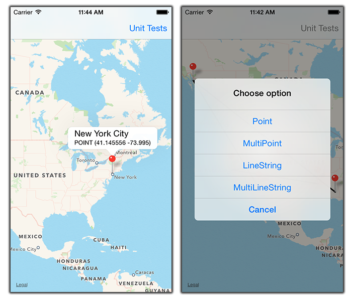

**WKTParser**
**Well-Known-Text Parser for Objective-C**

    

WKTParser Library have any conversions, parsers and formats. This library allow you parser three main types of WKT data: points, lines and polygons (single, multi, 2D and 3D).
Also you can convert WKT format to MK format (2D) like MKMapPoint, Polyline, Polygon or Annotation.

=========

**Installation**

**Via xCode Project**

Open WKT Parser Project, Drag & Drop Library and Library Support group over your Project and reference at your header WKTParser.h

**Via Source Code**

Simply, add Library Folder at xCode Project and reference at your header WKTParser.h

=========

**WKT Parser Documentation**

Documentation has been generated by [appledoc](https://github.com/tomaz/appledoc)

Its appledoc files (atom, xar) and html is published on [Documentation folder](./Documentation)

=========

**Unit Tests**

Run via the Product menu > Test or CMD + U

=========

**Credits**

Alejandro Fdez. Carrera

**Apps using this library**

Ontology Engineering Group (OEG) [Map4RDF Lite](https://itunes.apple.com/es/app/map4rdf-lite/id828604407?mt=8)

Center Open Middleware (COM) [YaaST Map (Appcelerator Module)](https://github.com/centeropenmiddleware/YaaST-Map)

**License**

WKTParser is available under the MIT License. See the LICENSE file for more info.
